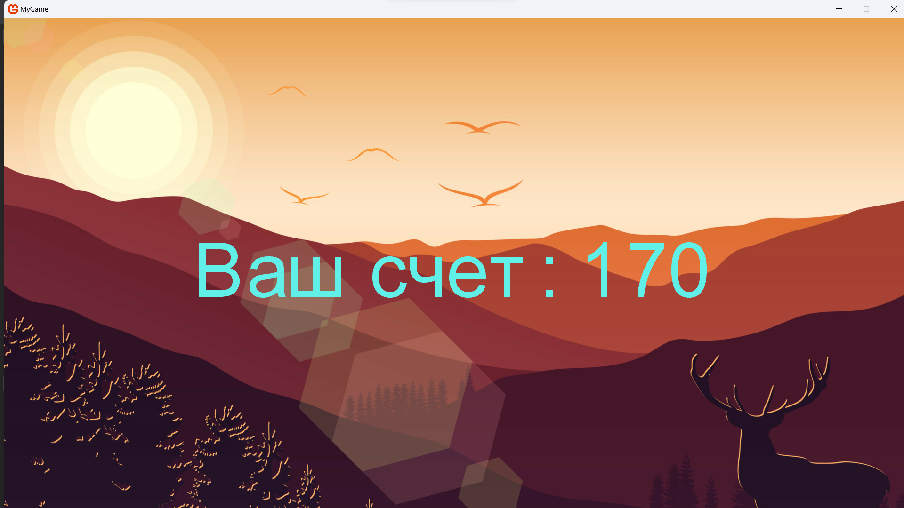

# MyGame

Простой шутер с возможностью выбора сложности на C# с использованием MonoGame. Игра сделана в рамках курса
[Основы программирования на примере C#. Часть 2](https://ulearn.me/Course/BasicProgramming2/Steki_i_ocheredi_48016626-87ae-411d-ae97-f7a49e465dbc)

## Особенности:

* Архитектура основанан на паттерне MVC
* Написаны модульные тесты

## Скриншоты

